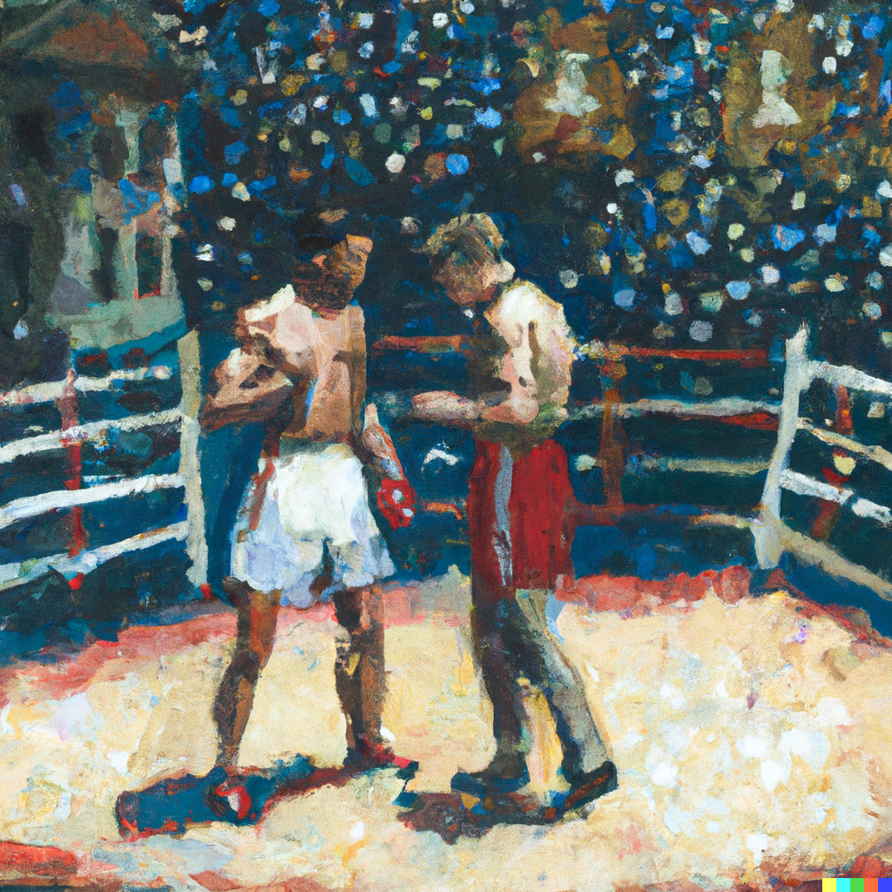

# `op-challenger` • [](https://github.com/clabby/op-challenger/actions/workflows/ci.yaml) 

> **Note**  
> Work in progress.

A set-and-forget challenge agent for the [OP Stack](https://github.com/ethereum-optimism/optimism) written in pure Rust 🦀

## Usage

```
op-challenger [OPTIONS] \
  --l1-ws-endpoint <L1_WS_ENDPOINT> \
  --trusted-op-node-endpoint <TRUSTED_OP_NODE_ENDPOINT> \
  --signer-key <SIGNER_KEY> \
  --dispute-game-factory <DISPUTE_GAME_FACTORY> \
  --l2-output-oracle <L2_OUTPUT_ORACLE>

Options:
  -v, --v...
          Verbosity level (0-4) [env: VERBOSITY=]
      --l1-ws-endpoint <L1_WS_ENDPOINT>
          The Websocket RPC endpoint used to index and send transactions. [env: OP_CHALLENGER_L1_WS=]
      --trusted-op-node-endpoint <TRUSTED_OP_NODE_ENDPOINT>
          The HTTP RPC endpoint used to compare proposed outputs against. [env: OP_CHALLENGER_TRUSTED_OP_NODE_RPC=]
      --signer-key <SIGNER_KEY>
          The private key used for signing transactions. [env: OP_CHALLENGER_KEY=]
      --dispute-game-factory <DISPUTE_GAME_FACTORY>
          The address of the dispute game factory contract. [env: OP_CHALLENGER_DGF=]
      --l2-output-oracle <L2_OUTPUT_ORACLE>
          The address of the L2OutputOracle contract. [env: OP_CHALLENGER_L2OO=]
  -h, --help
          Print help
  -V, --version
          Print version
```

## Contributing

See [CONTRIBUTING.md](./CONTRIBUTING.md)

## License

[MIT](./LICENSE.md), forever and always.

## Credits

- Optimism (https://github.com/ethereum-optimism/optimism)
